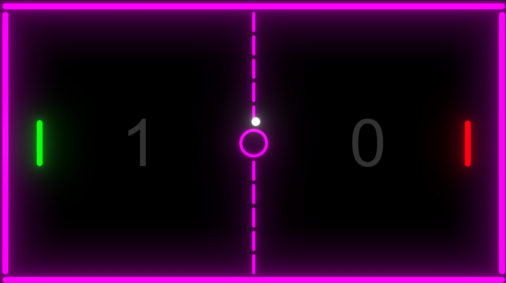
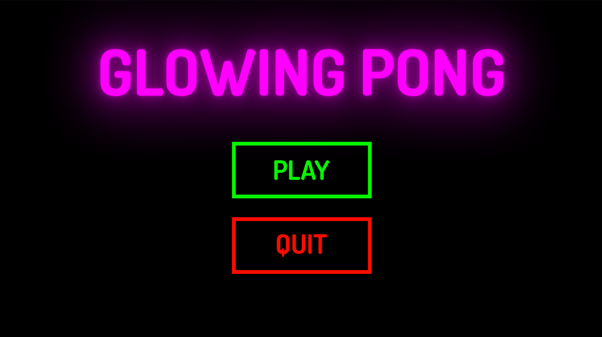

# Glowing Pong

The classic video game recreated in Unity with a neon theme!







## Run Locally

Clone the project

```bash
  git clone https://github.com/alexup19/Pong.git
```

Run in Unity

```bash
  Open Unity Editor then click the "Open" button then "Add project from disk"
```


## Controls

Just like the classic Pong, this is a two-player game.

Player 1 - Move the left paddle using the W and S keys.

Player 2 - Move the right paddle using the Up and Down arrow keys.


## Demo

[Glowing Pong](https://alexup19.itch.io/glowing-pong) - Itch.io


## Acknowledgements

Based on the [Glowing Pong](https://www.youtube.com/watch?v=JZvNFrS7wTM&pp=ygUMZ2xvd2luZyBwb25n) tutorial video by [Hooson](https://www.youtube.com/@hoosontech)

